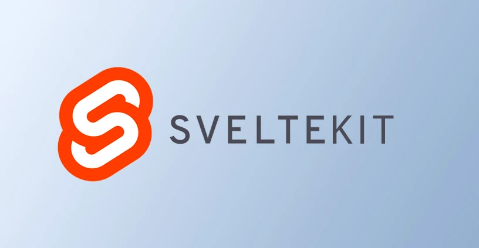

This blog is powered by `SvelteKit` and `MDsveX`  
Template by [Matt Jennings](https://github.com/mattjennings), thanks ❤️

## We ❤️ Svelte + Open Source
[SvelteKit](https://kit.svelte.dev/) is the JavaScript framework empowering people to do more with [Svelte](https://svelte.dev/).  
`Svelte` and `SvelteKit` are free open source technologies developed by [Rich Harris](https://github.com/Rich-Harris).

The backend is powered by `Markdown` thanks to [MDsveX](https://github.com/pngwn/MDsveX). Content is edited locally and tracked with git on GitHub. Furthermore we use [Obsidian](https://obsidian.md/) for an amazing `.md` editing experience.

The pages generated are completely static, therefore deployed and hosted on [Vercel](https://vercel.com/). Static sites ensures a very lightweight CO2 footprint, as well as blazing fast loading times.

## Thank you Matt Jennings

This blog was created with the amazing [SvelteKit Blog Template](https://github.com/mattjennings/sveltekit-blog-template) by [Matt Jennings](https://github.com/mattjennings). Without his work, it would not have been possible to get up and running with a lightweight cool blog site this fast.