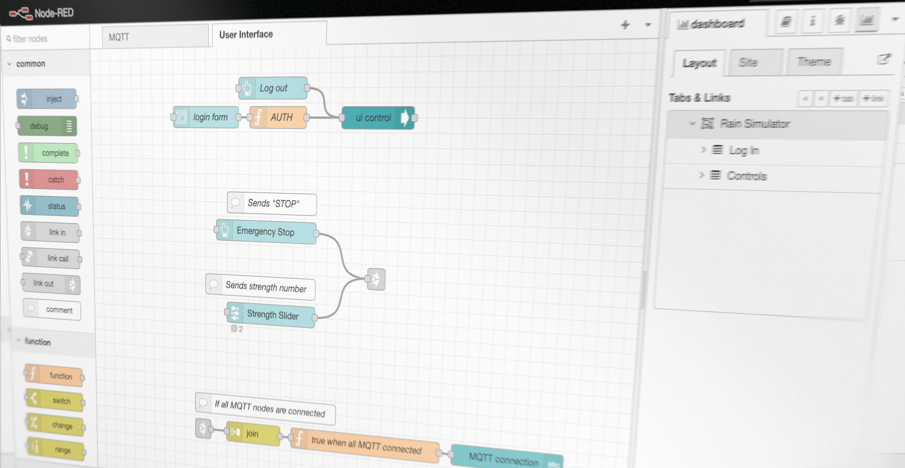

`JavaScript`, "fun" with `node-red` and also more **3D printing!!**

This blog post is going to a shorter one! We're very busy at work, but will be back next week with a very in-depth and detailed post about everything you need to know about 💦 ***Real-Splash*** ™ 💦.

## Summary
August and Kristoffer finished the 3D print prototype of the case for the set up. They joined the group afterwards, where we were looking into Nodered and how to connect mqtt’s with functions and the UI. It was the primary focus today. We wanted to send a message to the user whether it was raining or not, which we built up by an if-statement.