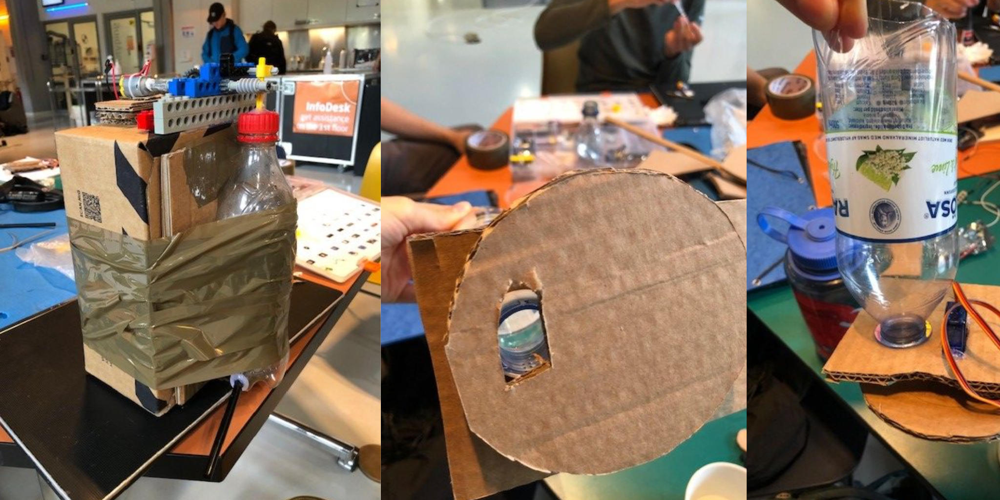
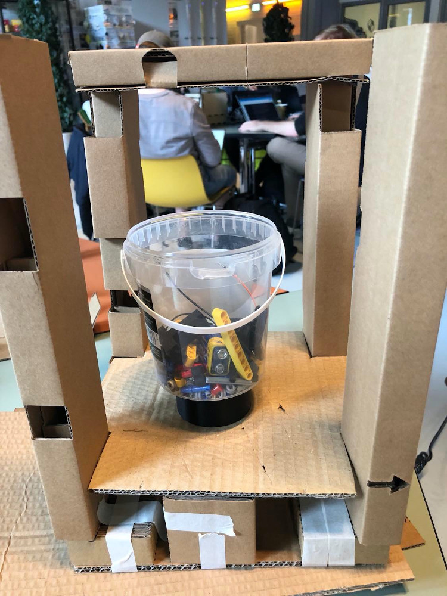
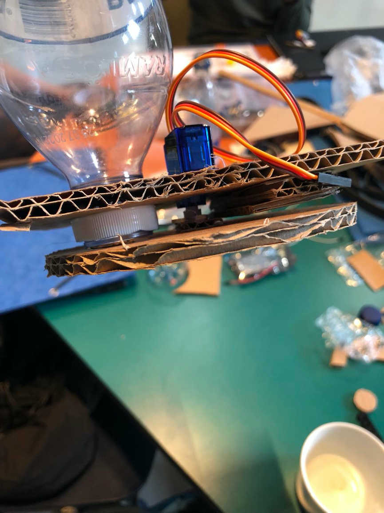
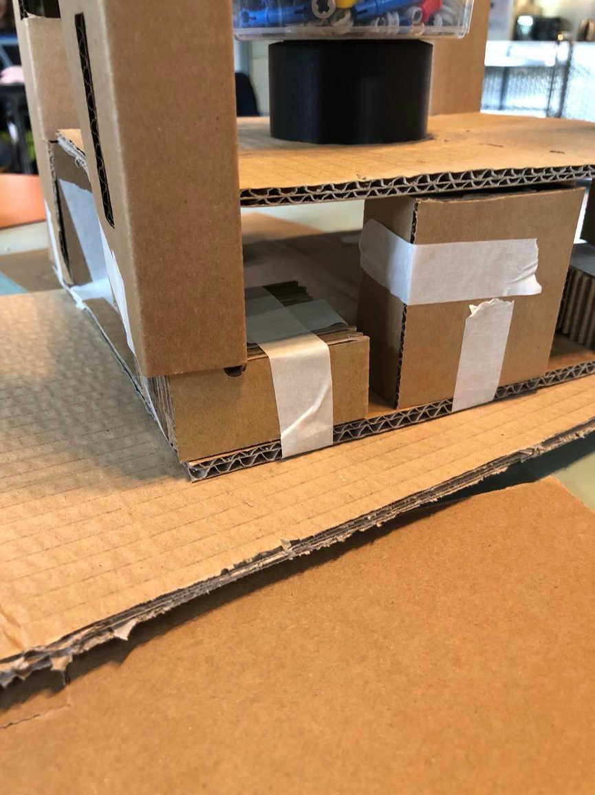
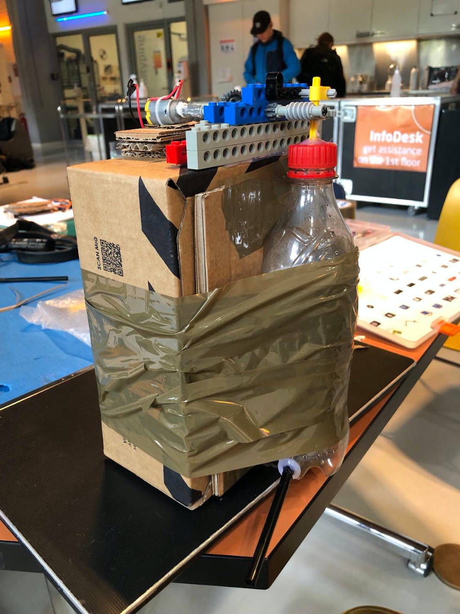
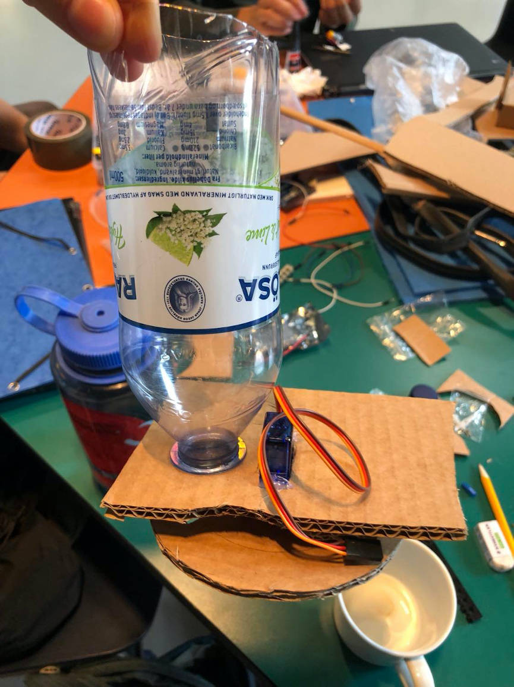
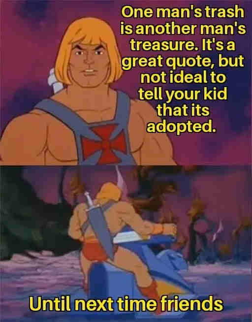

Ever wondered how cardboard mixes with sourdough? 🤔 ***Click to find out!*** 😳

Today we made the first prototype of cardboard, tape, lego and lots of other good sh\*t from the garage.

The casing for the sourdough hotel got cut out of cardboard.

Unfortunately the glass got broken, so we had to redo all the measurements and redesign the casing. Next time we meet in the lab we will cut it out of wood to make it more robust, and will also experiment with styrofoam to make a sealed case.

And now for some pics:

Until next time!