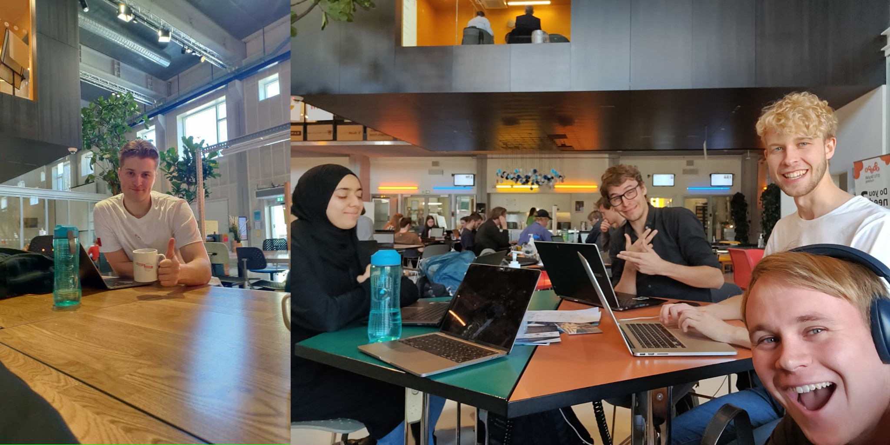
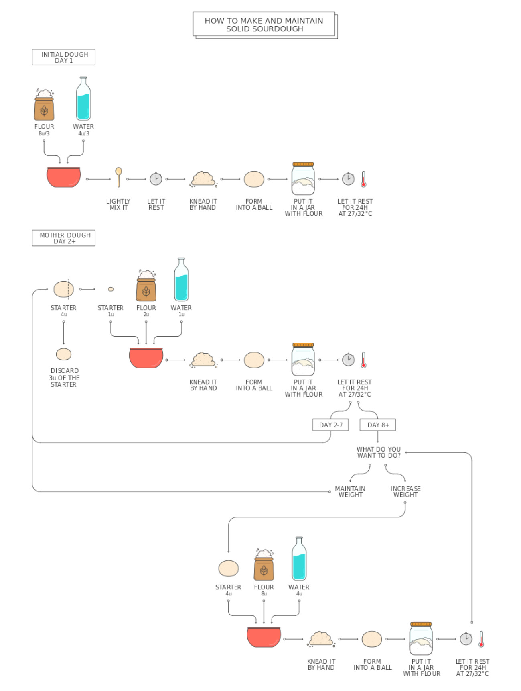

**"Hello Sir - You can now check your sourdough into the hotel 👨‍✈️"**

Those will be the epic words greeting our guests when they check in their sourdough to a stay at our Sourdough Hotel. Allowing people to store their sourdough under perfect conditions. 

Here is a random diagram:

Today we started working on a lot of different things. Firstly we made a plan to divide different fields of work & but also loop in Jonathan & Alex that were sick last week. When everyone was pumped up and ready to get going we started working on the first phases of prototyping. Especially proving that the cooling system can work in real life, and slow down the fermentation process was important. We also started looking into “funktionsmiddeltræ” with all the different functions required. To get a better understanding of the future design process some in the group also began working on detailed list with all the different design requirements. It was also very important for us to understand the complex chemistry of a good & healthy sourdough. Here we discussed the different approaches to how one can make a sourdough best. For the future prototype planning process we intend to look further into these key elements making an alpha prototype of the project:

1.  Proof of concept (cooling system)
2.  Working on the other exterior (How should it look)
3.  Design mixing tool. How we blend/ mix the sourdough once in container
4.  Working on a CAD rendering  

STAY TUNED FOR NEXT WEEK'S ADVENTURE!