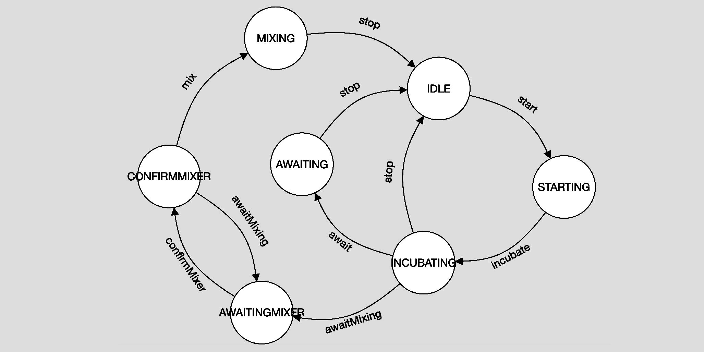
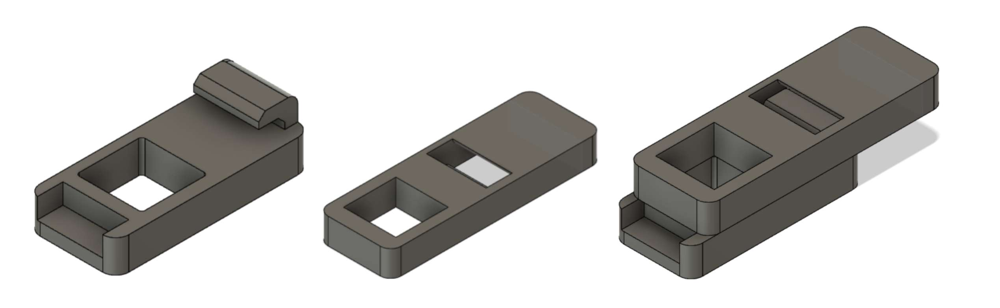

Finite state machines... Infinite state machines? Is that even a thing? Not really... Read along!

### Node-red
Things have been a little quiet regarding node-red here on the blog - that's because Jonathan and Alex has been busy (while locked up in the basement) designing subprotocols, building finite state machines, and writing code.

*"But what **is** a finite state machine !?"* - you ask.

Nobody really knows, and neither do we, but it's some kind of design pattern in programming that helps restrict the realm of posibilities of control-flow in code. It's an alternative to nesting hundreds of if-else statements.

Maybe we can't explain it that well, but the way it helps us is, by controlling *when* certain states are activated, and what next states are possible from that state on. Today the FSM was mostly finished, and finally implemented in node-red. We used the [node-red-contrib-finite-statemachine](https://github.com/lutzer/node-red-contrib-finite-statemachine) library.

The tricks to making the library work nice in integration with our node-flows, was to store the current state in a global context variable, whenever the state would change. This way the current state could be retrieved asynchronously without the FSM triggering a new state change - this is great, because it allows to work within the FSM pattern when it makes sense, but also to work around it when the pattern is not productive.

### Magnet mechanism
The magnet mechanism for the scraper was done and developed and as we went for a dough hook inspired by the kitchen machine from Ankarsrum, we made the thickness of the housing bigger so a hole with support for the hook could be integrated. The dough hook was then prototyped in cardboard in different shapes and thickness to see which fitted the best. Then we cutted the round steel in the desired length and bent it for the desired shape.

