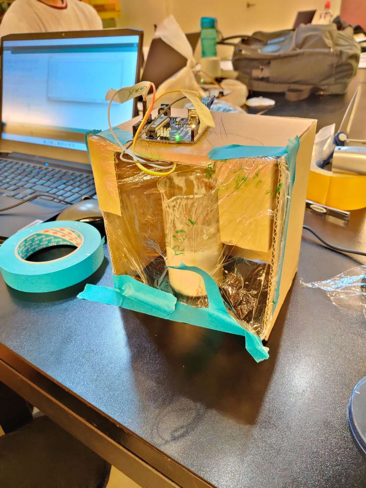

We had a design review today with a group who also worked with a sourdough machine.

As we were done prototyping individual parts for both the scraper and the stirrer, we could now focus on developing the whole box with the right measurements. We also had a design review with another sourdough group, which was nice to complement each other and see how similar we were thinking as well as getting feedback.

### Height sensor
The first test of the sensor was done in 13 week. Back then it was made without dough.

Today we tested if we could measure the growth of the dough while it is rising. We found that the placement of the sensor is very important, otherwise it worked sufficiently.

To include a PH sensor instead might give us some better data, but we think that this is good enough.
