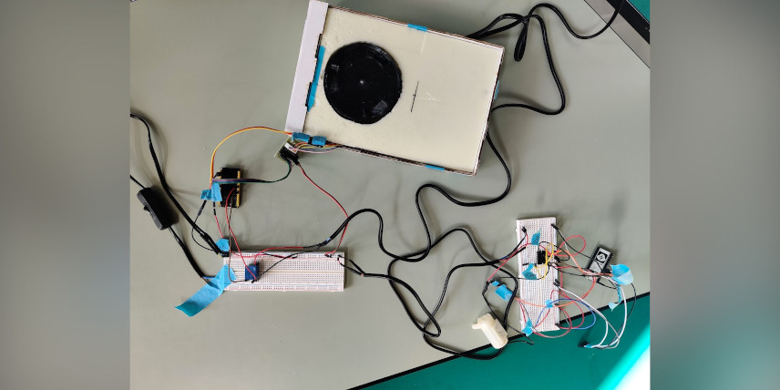

Last complete system tests, before we assemble everything and embed the hardware.

Today we tested the entire system and control of the different components connected to the bottom ESP32 with the app.

We also worked a lot on the final report and made the powerpoint we will use for the exam.

Lastly, we made some more detailing on the housing for instance, carved the name of the group and some other details on the wood.