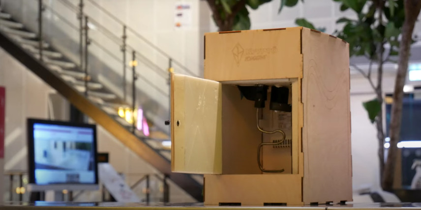
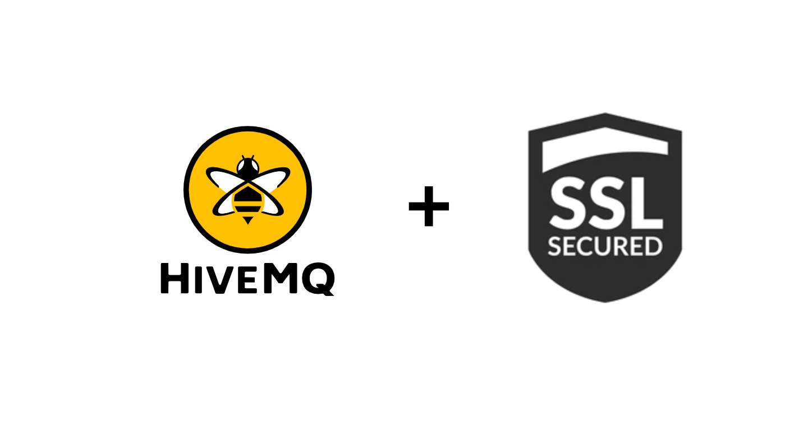

Today we finished the housing for the sourdough hotel. (& some MQTT issues)

### System testing
We start testing the entire system and control of the different components from the app. We started with the motors and sensors connected to the top ESP32. Throughout the project we have had problems connecting to our broker. Our experience was that most services tend to work great initially, but since they’re all free, perhaps they’re compromising uptime etc. after a few hours, because usually that would be the pattern - a broker works great initially, but becomes completely unusable after a day or two. However we did have a really solid experience on HiveMQ broker.

### HiveMQ & SSL issues
We had been holding back with adding support for HiveMQ on the hardware code, because their SSL security was giving us trouble, since we were not experienced enough with this more advanced security feature.

### Solution ✅
We were able to fix it by designating time to propper research, and it turned out we just had to set a certificate key value on the hardware code, which we could fetch from the server with a simple unix command.

After doing this, we could support HiveMQ, and we never had to try out other brokers. We had used both MaQiaTTo and CloudMQTT, but ended up far from satisfied. **We have been very happy after supporting HiveMQ and never looked back.** We experience a few outbursts of downtime from the HiveMQ broker, but the server gets connected again very shortly after each outburst. This is to be expected with a free service. It’s a great service, especially because it (unlike the others) ships with SSL / TSL out of the box.

Furthermore, we were brainstorming how to set up the video and started on writing a manuscript and writing down ideas on scenes we want to include.