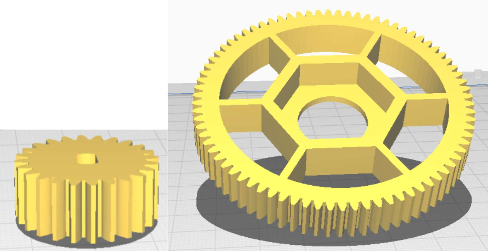

Today, the first prototypes were built. We want to move fast and break things 😈

Today, the first prototypes were built. One of the sourdough's key functions is the mixing mechanism. The idea is that the cup is inserted together with the scraper, which attaches inside the hotel. It is held in place at the bottom of the cup. It was important for us that the scraper could detach easily also. Under the cup we have a mechanism with a stepper-motor and gearing that rotates the cup.

### Cup Support
Testing different support teknisk to prevent the cup from tipping over when mixing the dough.

In the picture we see 3 different ideas. but in the end we decided not to go further with any of them.

### Cupholder
The first idea we tested out was the simplest idea of using wedges that are glued under the cup which will go down into the corresponding holes of the rotating disc, which holds the cup firmly. We experimented with number, size and shape and how the wedges should slide into the holes. All prototypes were quickly cut out in cardboard. After testing the mechanism we found out that we liked the idea of turning the cup into place. We chose to go ahead with the idea and test it out so we made CAD of the disc and the 3 wedges that we put to 3D print over the weekend.

### Scraper
It could be essential to hack the design of the locking mechanism of the different hooks from already existing kitchen machines. But we had an idea that it could be easier to attach with magnets. So we wanted to test whether the magnets were strong enough and found out they are quite powerful. Therefore, we chose to go on with the idea and thought about how the housing for the magnets should be. We drew a house and 3D printed the first prototype and tested it. For this we used the old scraper from the 13 week prototype .

### Rotation mechanism
Under the bottom there is a stepper motor that will rotate the cup. We drew a CAD model of the gearing that should drive the rotation. On the stepper motor a little gear should drive a larger one and the big gear will be attached to a shaft. At the bottom we have a ball bearing and at the top is our disc with the holes that the wedges under the cup can slide into. We set it to print over the weekend.

### Cooling
Fist test

The element is getting cold and the hot side is not getting too hot. It will be a good idea to put another heatsink on.