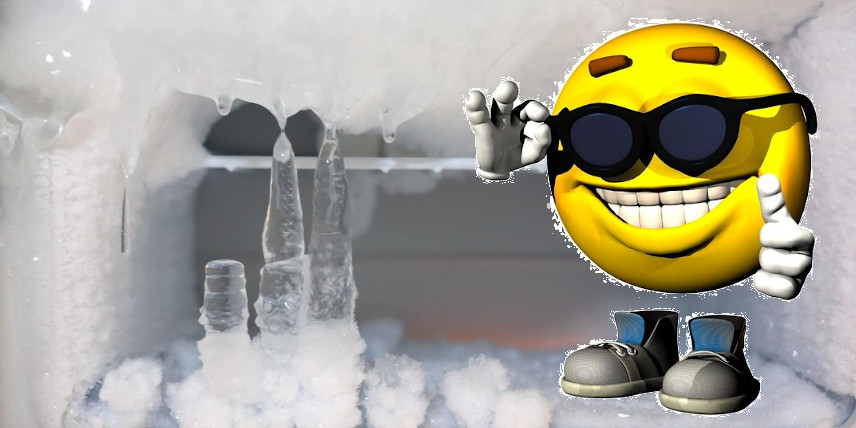
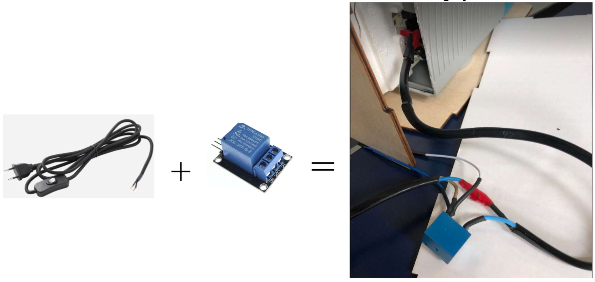

Today we focused on getting the cooling system to work with the ESP32.

We soldered a relay to an On/Off cable to be able to control the switch through the Arduino. The cable itself was soldered to the terminal of the cooling system.

We also laser cut sheets of wood that would make up the housing for the sourdough hotel.
-   Testing of the sensor
-   Testing the code of the servo motor