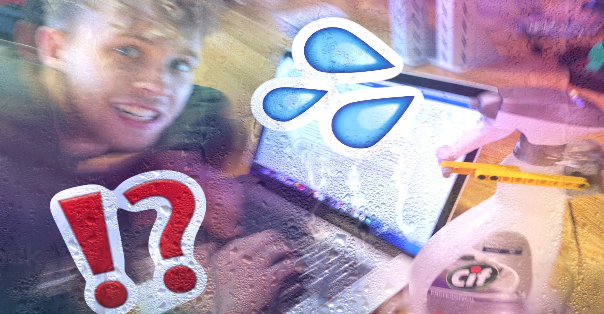
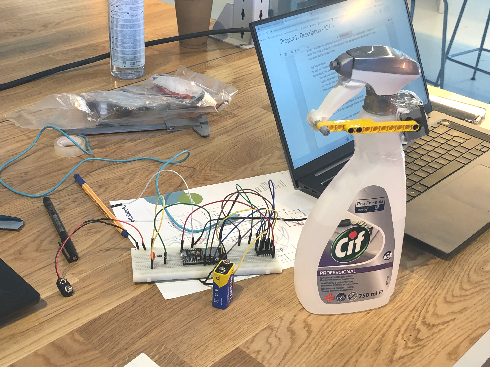

We added **node-red UI** and started prototyping the physical setup.

Today we had a blast with getting Jonathan wet. Andreas & Mouna used legos to prototype our mechanism for spraying water (raining) on the user, which was tested propperly and thoroughly.

We also had some trouble with getting our MQTT broker (`MaQiatto`) working, but we will look into that before next time. What we *did* get working in `node-red` today though, was the `node-red-dashboard` UI interface, as well as publishing from MQTT clients (node MCUs).

Here is a cute snapshot of the prototyping area of our table from today:

## Homework
Before the final project day on next friday, we agreed to meet Tuesday to work on some stuff. We agreed to do some homework before meeting again:

**Alex & Andreas**
* MQTT Client Publishing
* H-Bridge & motor drive

**Jonathan:**
* Brings voltage regulator
* MQTT broker

**Mouna:**
* Begin final blog post

**Mounta, August & Kristoffer**
* Node-RED flows *research*