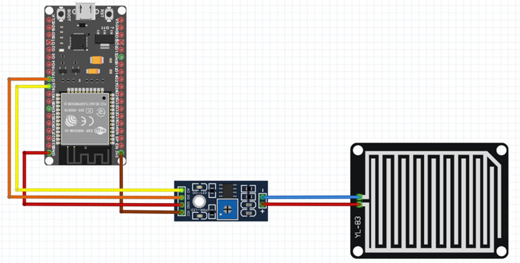
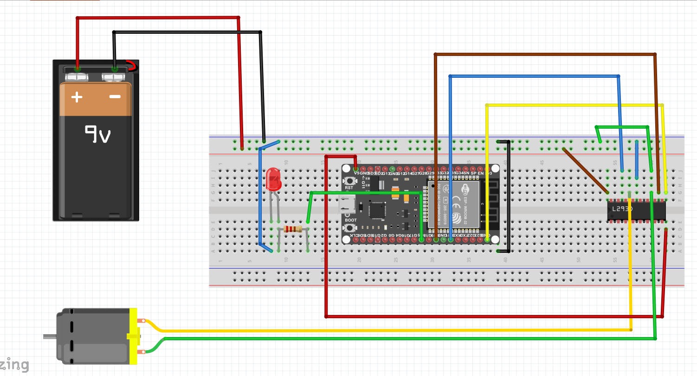
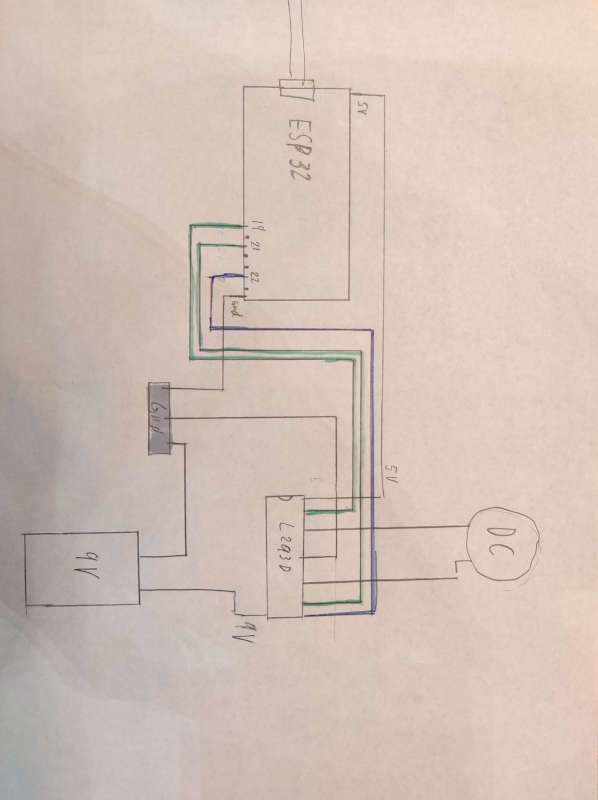
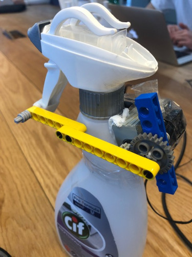
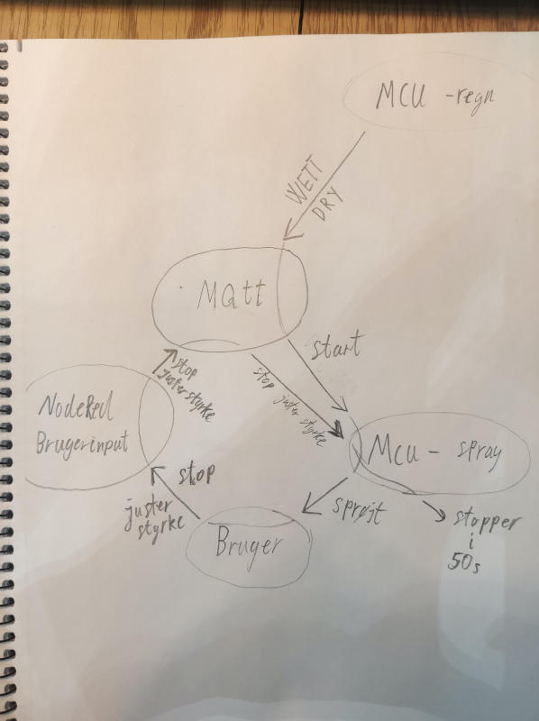
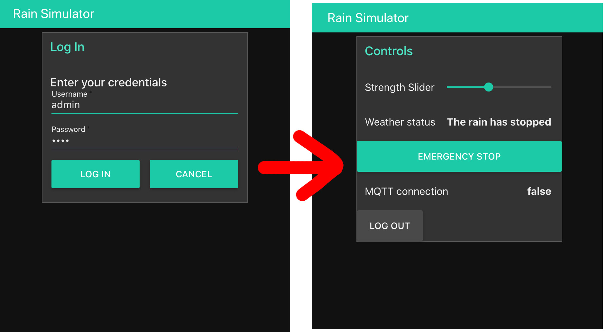
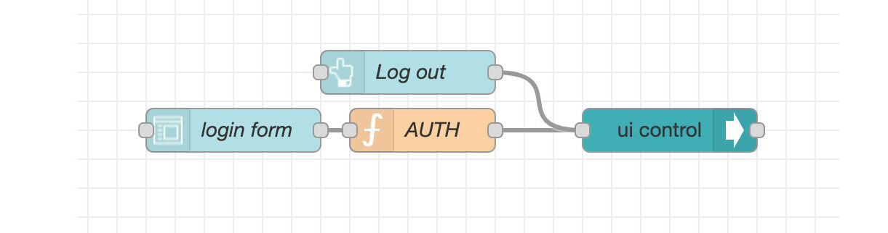
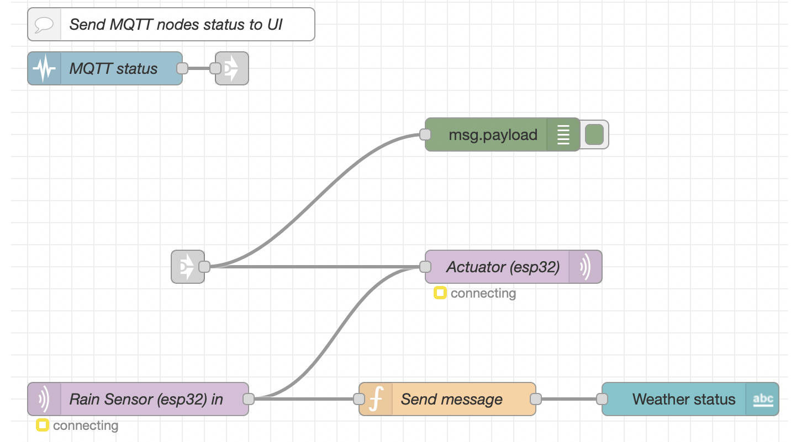
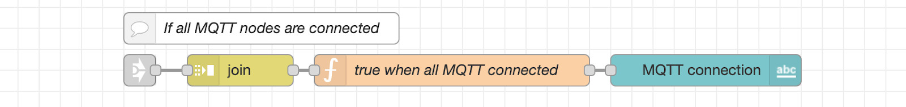
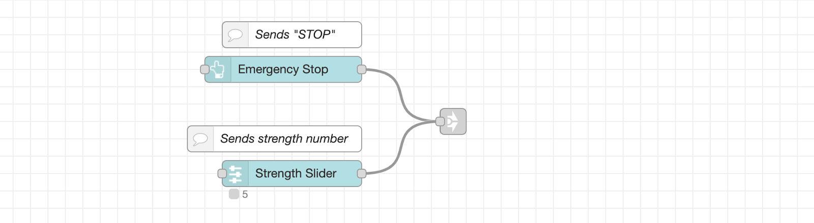

What a crazy ride it's been, thank you all so much for following along on here 😥 


Check out the `node-red` project on [azure@137.135.141.84:1880](http://137.135.141.84:1880/)

The dashboard / app can be found at [/ui](http://137.135.141.84:1880/ui/), login with: `admin | 1234`
#
# **Chindōgu: Indoor Rain Simulator**
The goal of this project was to design an IoT Chindogu prototype that senses when it’s raining outside and gives you a refreshing notice in the form of being sprayed in the face with water.

For this we use Node-RED that is a visual programming language that allows us to communicate wirelessly with a NodeMCU and make a web-based UI.


## How does the prototype actually work?

The prototype consists of two physical parts and a digital interface. 

-   The rain sensor (outside)    
-   The spraybottel (inside)
-   Interface (APP)

#### Rain sensor
The rain sensor (rain sensor + LM393) is outside the whole time. When it starts to rain the NodeMCU publishes (status WETT) to the MQTT Broker via NodeRed. Otherwise it publishes (status DRY).



#### Spray Bottle
A DC motor is laminated onto the bottleneck with glue(matrix) and paper(fibers). It is connected to the grip with LEGO pieces so when the motor is running, the LEGO arm rotates and thus presses the handle and sprays water.

A NodeMCU subscribes to the MQTT broker via NodeRed. If it receives the message wet. the engine is instructed to drive. As a motor controller we use an H-bridge (L293D). A 9V battery supplies electricity to the whole setup.





**An overview of the connection between our two setup and the MQTT broker:**

## Code 
#### The rain sensor (NodeMCU) data
The rain sensor is a simple sensor that consists of 2 wires running exposed on a board, when a raindrop then falls on this, the wires short circuit, and the sensor says wet. 

The code for running this is as follows:

```cpp
const int capteur_D = 4;
const int capteur_A = A0;

int val_analogique;

void setup()
{
	pinMode(pin_D, INPUT);
	pinMode(pin_A, INPUT);
	Serial.begin(115200);
}

void loop()
{
	if(digitalRead(pin_D) == LOW)
	{
		Serial.println("Digital value : wet");
	}
	else
	{
		Serial.println("Digital value : dry");
	}
	delay(10);
}
```
  
**To publish this data we connected this code with the MQTT example from week 7:**
```cpp
void loop() {
	if(!client.connected())
	{
		reconnect();
	}
	client.loop();
	if(digitalRead(capteur_D) == LOW)
	{
		client.publish("s203775@student.dtu.dk/esp32_actuator", "WET");
		Serial.println("Digital value : wet");
		delay(10);
	}
	else
	{
		client.publish("s203775@student.dtu.dk/esp32_actuator", "DRY");
	}
	delay(1000);
}
```
We publish the `WET` data, every second.

#### The spray bottle (NodeMCU) Motor control 
The motor is controlled by two digital inputs and one analog input. The two digital inputs control the direction at which the motor is running and the analog input controls the speed at which the motor is running.

The speed at which the engine runs can be controlled through the slider in the App. To translate input from the slider to engine speed, a small function "speedFromStrength" has been built which has three inputs "speedMin, speedMax and strength", where the power comes from the slider in the app.

```cpp
#define strengthMax 5
#define speedMin 0
#define speedMax 255
int strength = 0;     // get from app

int speedFromStrength(int x) {
	// equation, x in range [a,b]:
	// x(a,b) = (b-a) * ( (x-x[min]) / x[max]-x[min] ) + a
	// x[min] assumed 0:
	return (speedMax - speedMin) * (x / strengthMax) + speedMin;
}
```

## Node-red
In order for the user to enter the UI dashboard in the app he’s asked to fill in a login form with a username and login:
```shell
Username: admin
Password: 1234
```



It hides or shows the UI depending on whether you type the correct login / or if you log out. The flow for that is:


What makes the “authentication” work for the login is the AUTH function.
```js
const { Username, Password } = msg.payload
let showControls = false
if (Username === "admin" && Password === "1234" ) {
    msg.payload = {
        "group": {
            "show": [
                "Rain_Simulator_Controls"
            ],
            "hide": [
                "Rain_Simulator_Log_In"
            ]
        }
	}
}
return msg;
```

The payload input in the function is the result of all fields in the submitted form, ie. username and password. These properties are *destructured* from the original payload. The correct “credentials” are then hardcoded into the if-statement. If the condition is true, the payload will get changed (mutated) into a JSON object that allows controlling the UI with the ***UI-control node*** in node-red.

A similar JSON object is sent to the same UI-control node when the log out button is pressed, except the `"show"` and `"hide"` fields are inverted, such that the controls will get hidden again, and the user is locked out and presented with the login group once again.

This is not really a propper login system, since the password is not encrypted, and it’s extremely simple. But it gets the job done for this project.

#### Connection and message:



The flow is driven by the MQTT out and in nodes in node-red. The status node monitors the status of only these two MQTT in and out nodes, and passes it on to the User Interface flow.



The messages are joined into arrays of length 2 (the status of each MQTT node), and interpreted by a custom function that checks if any of those 2 status objects are not connected.
```js
const connected = !msg.payload.some(x => {
    return x.status.fill !== "green"
})

msg.payload = connected

return msg;
```

If the fill color from each status object is green, it’s assumed that a connection is made.

**MQTT publish and subscribe broker connection with node-red:**

Notice how the MQTT in node (subscribe node) is directly connected to the MQTT out node (publish node). That means that whatever incoming messages the broker subscribes to through that node, will get directly published from the broker on the MQTT out node. That means, if one esp32 publishes “DRY”, which the broker then subscribes to, then node-red ensures that “DRY” is immediately published from the broker, and can then be subscribed to by another esp32, ie. the actuator / motor system. This makes it possible for 2 esp32 chips to interact with the broker as a middleman. If it rains, the motor can turn on, if it’s dry, the motor will remain turned off.

There is also a link out connection feeding directly into the MQTT out node. These signals originate in the User Interface flow.

This flow shows that if the emergency stop button is pushed down in the UI, the payload string message `“STOP”` will be sent via the link out node, and back into the MQTT flow and MQTT out node.

Whenever the strength slider changes value, it will send a number with the slider value as the payload. It’s then possible on the arduino to interpret what kind of payload is being received, and if it looks to be a number, we can interpret that as a strength value.  

If this system was more complicated and required more controls, another possibility would have been to create a JSON payload. Then there could be various fields, eg:

```js
{ 
 strength: 3,  
 emergencyPressed: false,  
 ..  
}
```

However this also requires decoding of JSON on the arduino / esp32, and since we’re only working with a single numeric value, we can assume that any number we receive when subscribing to the broker from an esp32, will be the strength value.

## Reflections on work 

#### Problems

Motor problems: When we tested the setup out, we discovered that the motor didn’t have enough power to press the handle down. So we opened the bottle head and tried to weaken the grip. We saw some improvements but the motor was still not powerful enough. So the next thing we tried is to put on gearing and it worked 

Mqtt connection: We have had recurring issues with our Mqtt connection. It worked over several rounds but the next day we lost the connection. The solution that has worked several times has been to change the user name and code word. 

#### Power

Right now the two Esp32 are getting power from a usb cable. From the beginning, it has been the intention that the 9v battery that drives the engine should also supply Esp32. For this we would use a volt regulator() which would convert our 9v to 3.3v. For practical reasons, we did not achieve this.

#### If we had more time: 

It could be very interesting in a further expanded simulation of the weather, where we take into account both temperature, the amount of water that has fallen, and the strength of the sunlight by adding more sensors and a lightsource. We have also talked about how to approach the prototype, and made a very low fidelity box for everything. We actually find it interesting to build a box, where you can step into it and get a full time simulation of the weather. 

# A ‘who did-what’ page

**Rain sensor**
-   Physical parts:
-   Housing: Kristoffer & August
-   Electronic circuit: Alex
-   Code: Alex
-   Connection and publish: Alex og Jonathan
-   Circuit fritzing/drawing: Mouna

**Spray bottle and motor** 
-   Physical parts:
-   Gearing and build: Andreas
-   Electronic circuit: Andreas
-   Code: Andreas og Jonathan
-   Connection and subscription: Alex og Jonathan
-   Setup fritzing/drawing: Mouna

**Node-red**
-   Azure setup: Mouna, Alex, Jonathan
-   Mqtt borker setup: Andreas, Jonathan
-   JavaScript: Jonathan
-   Tying flows together, structure: Jonathan
-   Rain Sensor to Weather status: Kristoffer
-   Dashboard: Kristoffer, Jonathan, August, Mouna

**Blog and final report**
-   Creating blog site: Jonathan
-   Daily blog post: Jonathan
-   Final report: Mouna, Andreas, Kristoffer, Alex & Jonathan (everyone)

**3D printed box**
-   CAD & 3D printing: Kristoffer & August
# 
# ~
# ~
# ~
# ~ Until next time crypto-gang 💯 skrrt 💯