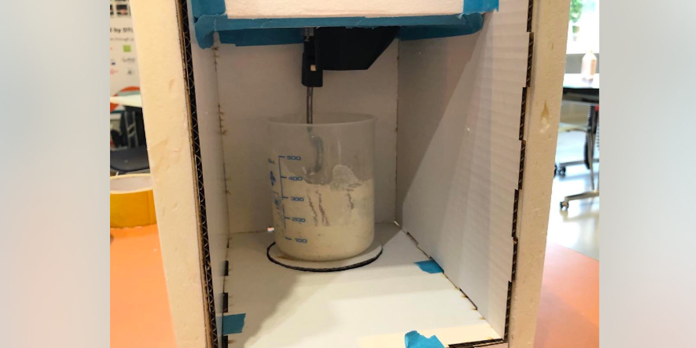

So today we built a new housing for the sourdough. Read all about it in this post!

Afterwards, we put the different parts together and ran the code for the stepper motor to see if the different systems work together. They did! The scraper got attached very easily and the motor was able to rotate the cup containing sourdough and actually mix it well.

### Code
Tried to increase the speed of rotation. We failed. The limit in the hardware was stopping us from getting the motor to run faster