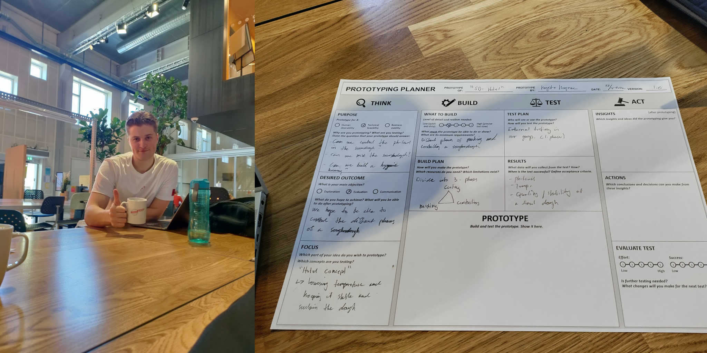
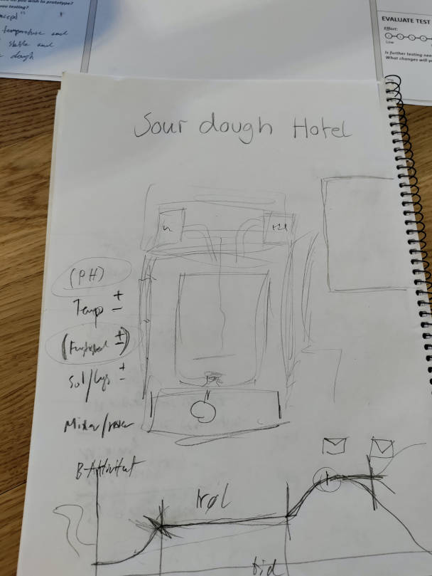

What the heck is a **Soughdough Hotel** ?? Click to find out! 😱

Today we began planning the prototype process for our “Soughdough hotel”. The concept is we wish to stabilize and keep a sourdough alive for a period of time. This requires a lot of different techniques to play together. We decided to divide the planning into three different stages for the prototype. Meaning the proof of concept is obtained in 3 levels: Cooling, controlling & mixing. Thereafter we filled out the prototype planner. The mood was very passionate about different kinds of sourdough! Hereafter different tasks was divided out in the team. And we began researching new aspects to the solution.

## Next week...

Next week we intend to do KJ & negative brainstorming to better understand & come up with innovative ideas to our problem.