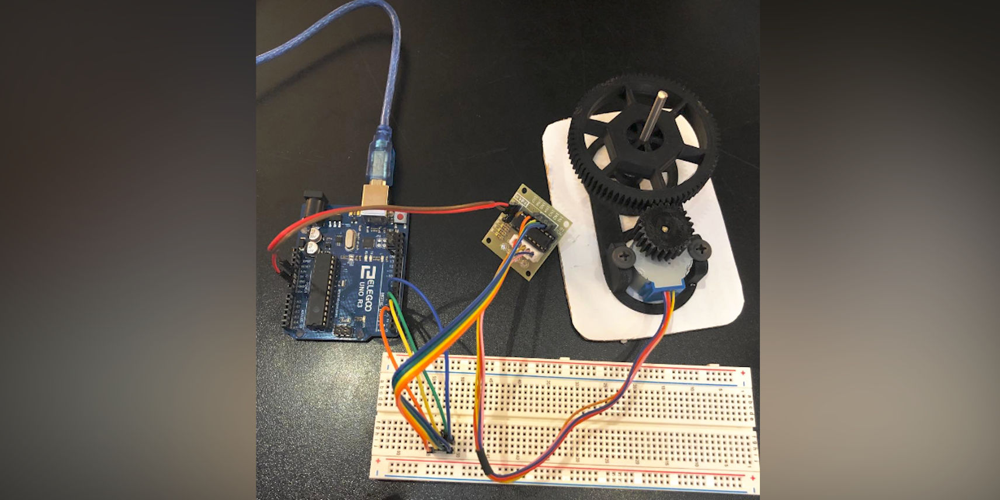

Now we had every part in place and were ready for testing the different mixing parts together.

The code worked smoothly and the rotation were consistent, but slow. However, we were very satisfied that it worked. Then we could focus on testing the disc together with our container and tested it with some weight to see if the gear system had enough power to rotate.