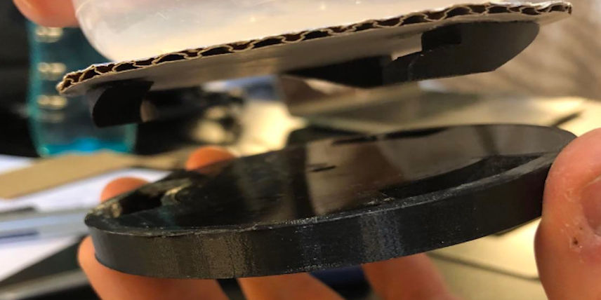
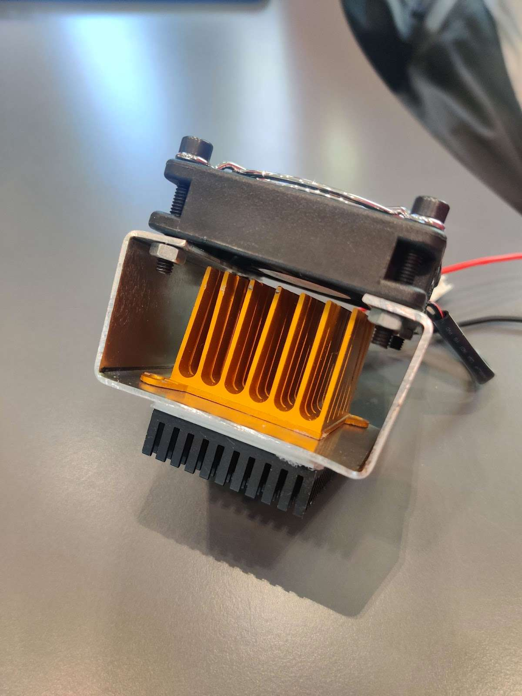
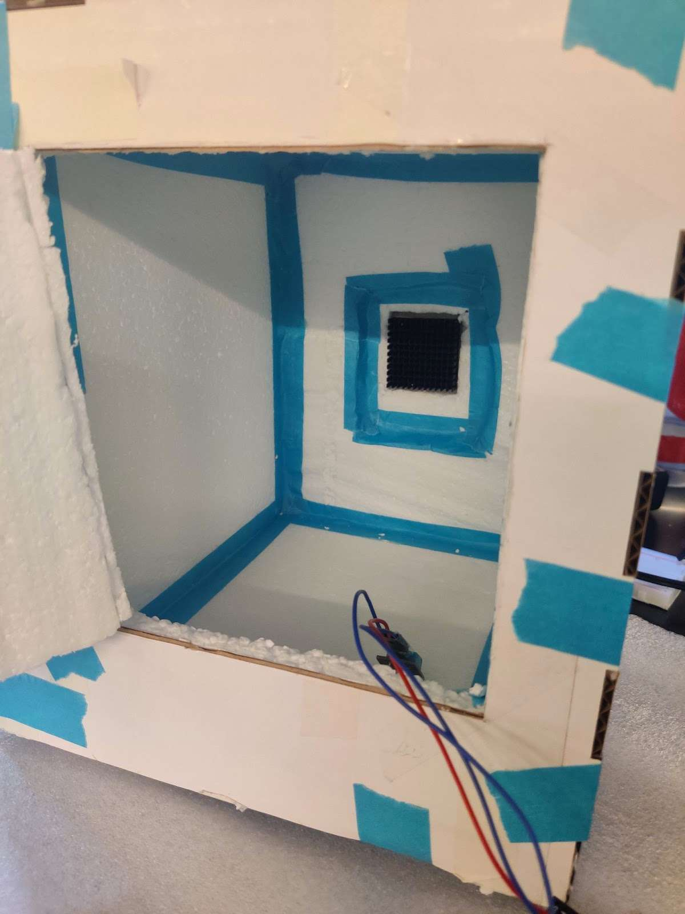
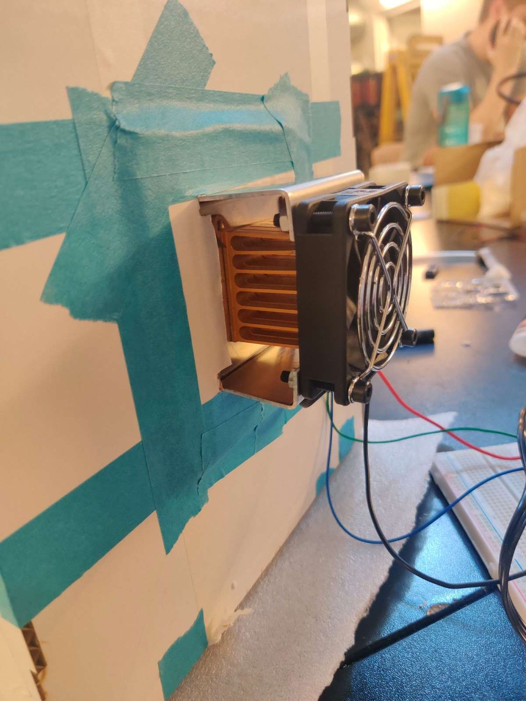
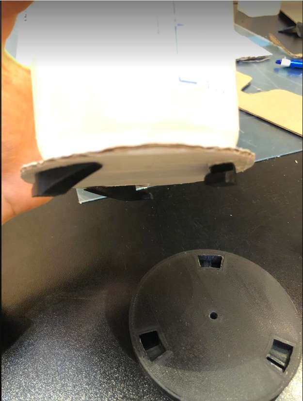
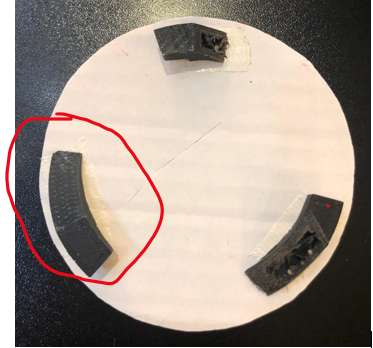
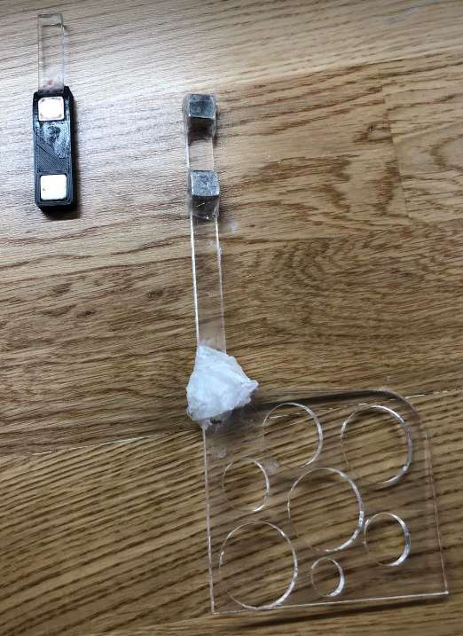
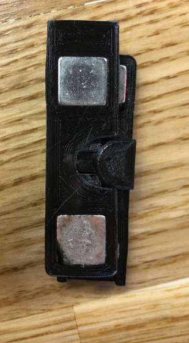
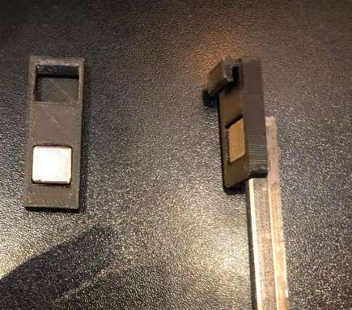
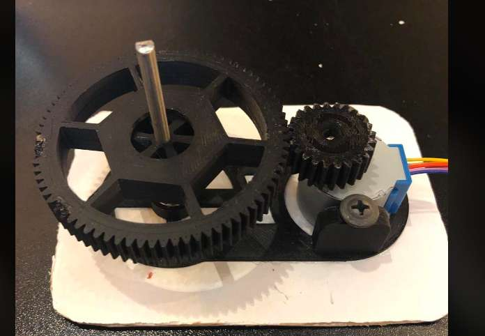

Improving upon last weeks initial prototypes. 3D prints and more! Let's go 💯

### Cooling

This setup seemed to have potential at first... The next step is to test on a box 😬

Test with one peltier element, one fan and too heatsinks. Placed inside an isolated box with a temperature sensor. We used a 9V supply.

**The cooling was very slow.** 😭

Insights: *We have a choice*. To find a stronger power supply and add a fan to the inside, and maybe install two elements, or buy something bigger and more efficient.

### Cupholder
Today we looked at our 3D Printed cup holder and the wedges. Unfortunately, they didn’t fit well in the notches, so we had to file all of them. After filing, we ended up with three different shapes of the wedges. We chose to go with the red circled one since it was the best and intuitively best showed how the two were attached. The selected wedge was measured and made in CAD to get 3D printed. We tested it out and it worked perfectly as expected.

### Mixing scraper
We were iterating over multiple ideas of how to snap the two magnets together and how to lock them into place when put together. We found out that we needed some kind of lock mechanism, as the torque was affecting the stabilization of the dough hook. We were inspired by a mechanism of a bicycle helmet with a magnet, which just connected right away, and needed to be slided to the side to separate it. We found it difficult to attach the two, when they should enter from the side, because of the poles from the magnet. Therefore, we ended up going with the front hook, which was easier to both attach and detach. Then we were iterating over shapes and measurements to make it perfect. We also concluded that it was strong enough with one magnet and the lock mechanism.

### Rotation Mechanism
The parts of the rotation system turned out pretty good. The gears gripped well into each other, but the hole for the shaft was too small so we had to drill a bigger hole in the disc. Next thing we did was to print out a bottom plate to hold and support the different parts and the stepper motor in place and glued that to a piece of cardboard.
