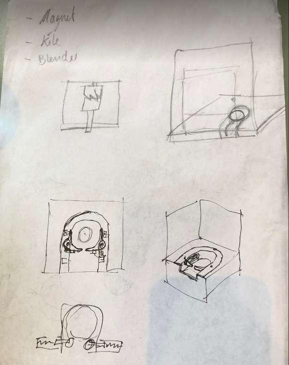

Today we begin the 3-week course on DTU. That means putting down a strategic plan.

We started out by planning the overall strategy for the 3-week course. The prototype strategy we are following is parallel prototyping and consists of a set of subsystems (housing, mixing, heating/cooling, coding). The prototypes will be quick and dirty and we will make it all function together. Our priority is to have 1 functional unit where all subsystems work and optimization as the second priority since we have many tracks running at the same time. 

We filled out the protomap and made a sprint plan for the first sprint. Our goal is to get an overview of the key functions and test it out.

At the end of sprint 1 we want to have a rough working system which is less aesthetically appealing. Furthermore, we started to write the prototype planners and in that way try to effectivise the process. We brainstormed on ideas and started sketching several different solutions, while other were coding.

