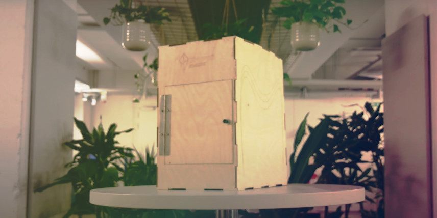
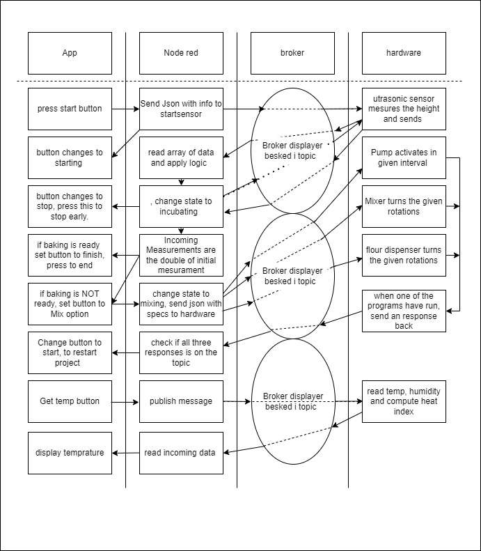
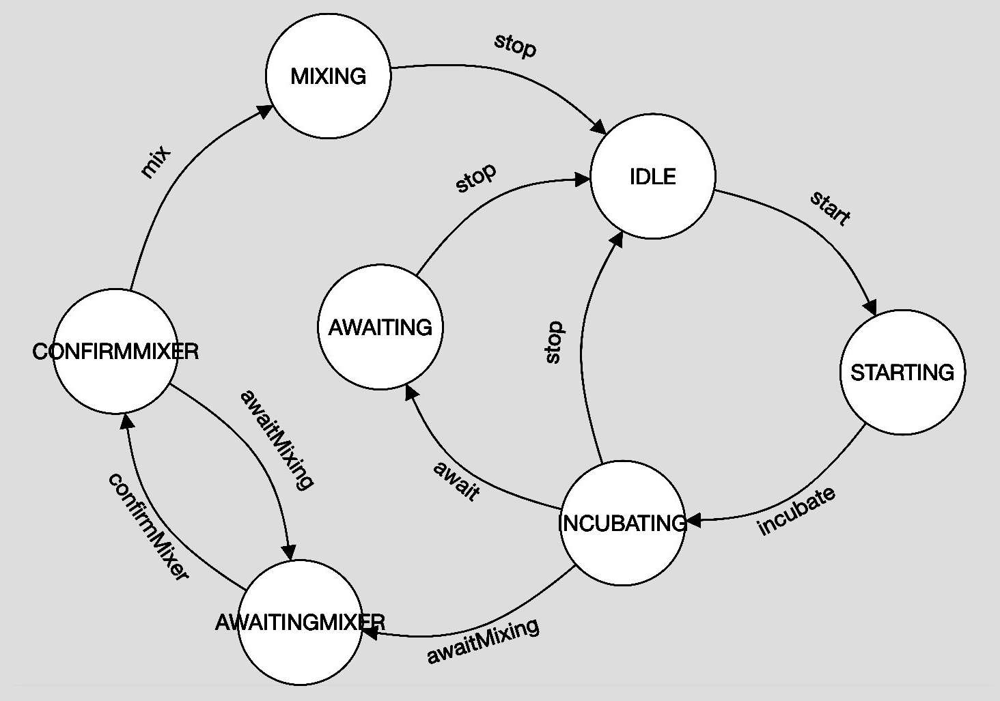

The result after working on a sourdough hotel for 3 weeks? Watch on [YouTube](https://www.youtube.com/watch?v=Z9Q-h7dPK7k) 🦄


### Description of the final concept:

Krypto Kongernes’ final product is a machine with many technological features that makes the experience of keeping a sourdough easy and joyful. During covid-19 there has been a rising interest in keeping sourdough and it is always difficult for a novice to properly manage and keep it. Furthermore, it is difficult to see whether the sourdough is peaking and baking ready. Therefore, we introduce a machine packed with equipment that will automate the process of managing a sourdough. The features are controlled with an intuitive UI design, which will let you know how the process is going. Let’s start from the outside and move us closer to the inner functions this machine can provide. The outer shell is made in a beautiful and organic material that fits the kitchen nicely, namely tree. From the shell to the inner walls, we have inserted isolation to help keep the temperature to the desired point. As this still is a prototype, our inner walls are made of cardboard. The temperature in our box can drop to under five degrees celsius, which is ideal if you are going on a short trip and not able to manage the sourdough. This is possible as we hacked a cooling system from a cooler box, and kept the shell, isolation, air circulation and printboard, which was cutted into the desired shape and integrated as our rear wall. Underneath the inner floor, we have developed a motor system that consists of a stepper motor, gear system, axle and a ball bearing. This will be able to rotate the cup and the sourdough will be mixed by a static round steel bar that you can take on and off by a magnet mechanism. Why is it important to mix the content? Well the machine also dispenses water and flour from the top, which the end-user can refill through a hatch. The water will be pumped into the container and the flour will be dropped, which is controlled by a servo motor that runs a mill. The end-users are very independent of how the condition of their sourdough is, and just need to refill the dispensing tanks and discard some of the sourdough, when needed. We estimate that the sourdough is ready for baking when it has reached double in size, where you get a notification. This will allow you to relax and do other stuff. 

We have limited the features of our app so that the user can control the basic things in the hotel. When we have collected a little more data, the user interface will be changed. At present, the user chooses whether she/he wants to bake or not and how fast the dough should grow. As the user works through the process, the button changes and the user can call different commands.

In the application the user is also able  to get the current temperature and humidity in the sourdough hotel, see the state of the mqtt broker, and test different inputs, the last two options are mostly admin focused.  

The different user flows are explained depending on the choice (see Appendix B).

### Evaluation of the prototype
Our prototype has become a little simpler than we first intended and the mixing system of the dough is also a little slower than we first thought. But overall, we have shown that all the functions work and can be controlled from the app.

The prototype's greatest strength is the structure of the Node-Red code. We have built our code in a way where all calculations and functions are controlled in Node-Red and can be changed at any time. In this way, we can further develop the functionality and user interface without having to pull out the electronics.

It's fairly easy to get the cup of dough in and out of the box but it's a little hard to see into the box and the manual interface can be improved. 

Overall, we have realized that it is not a product that the world needs, but as a school project it has been instructive.

### Key aspects from the process documentation:
In sprint 1, we started out by brainstorming ideas of how we want to build our prototype. Since there are many features, we split it up into subsystems and made specific group members responsible for a specific subsystem. 

We were experimenting with parallel prototyping, where we primarily focused on how to insert the cup, how the scraper should get attached, and how the setup is for the rotation mechanism. For the cupholder we were iterating over numbers, form, and shape of the wedges. We liked the idea of turning the cup into place. We chose to go ahead with the idea and further test it out. Unfortunately, the wedges didn’t fit well in the notches, and therefore filed three different shapes to test, which fitted the best. We made our choice and adjusted the design and it ended out working perfectly. We found out that it was steady enough to hold the cup into place and that 3 was the perfect number. 

For the scraper we came up with the idea of using magnets to guide it into place, and further tested out how we could make it steady when facing resistance from the mixture. After 3D printing different housing for the neodymium magnets we found the right mechanism that will lock the scraper in a tight hold and make it stationary and able to withstand pressure. It consists of a male part with a hook and a female part with the associated entrance. After we have finished the design we wanted to develop a hook inspired by an already existing design from Ankarsrum. So we cutted the round steel bar in the desired length and bent it to the desired shape. It was glued to the housing and the prototype worked very well and as expected it attached easily, but could have detached easier. 

To be able to rotate the cup, we integrated  a stepper motor. From that motor, we wanted a gear system that could withstand friction and the dough resistance. Therefore, we added a little gear that drives a larger one, which increased the strength. After 3D-printing we tested the parts, and the gears gripped well into each other. Next thing we did was to print a thin plate to stabilize every part and hold it into place. Now we had every part in place and were ready for testing the different parts together. The rotation worked fine, but it was too slow. We couldn’t change the speed, as it might have a limit in the hardware. However we were satisfied that it worked. 

Another subsystem is the cooling system. By controlling the temperature in the hotel, we can control the growth of the dough and keep it in hibernation until needed. 

We started out using one Peltier element, and a medium size heat sink and by testing we realized that we needed to cool down the hot side by adding a fan. 

In the second attempt we added a heat sink to the cool side and a fan to the hot side. It took 30 minutes for the temperature to drop down by 2°C. 

The heat sinks were too small, the power supply too low and the movement of air too low on both sides. Next, we came up with the idea of using the cooling system from a cooling box.

For sprint 2 we bought a cooling box, disassembled it and took out its cooling system and built it into our sourdough hotel. The results of our testing were that in a span of 30 minutes, the temperature dropped from approximately 24°C to 5°C which is exactly what we desired. 

We built a new interior for the sourdough. As it needed to be cooled down, we also isolated the box. Afterwards, we could insert the different parts that were developed in sprint 1 and test it all together. All the parts were working very fine, and we were therefore pretty much done with each feature that affected the condition of the sourdough. Next we wanted to optimize the look and therefore we were laser cutting the outer shell in cardboard, which fitted nicely. 

We were experimenting with the electric circuit and to determine the options of how to give all our subsystem power from the same power supply. We had a hard time finding the right power supply to supply enough current, and went an alternative way. The cooling box already had an integrated power supply, converting mains into 12v - therefore we soldered a relay directly into a mains cable, and had to be very careful when handling this dangerous hack. Since the integrated PSU most likely had a fitting current rating for the cooling box only, we ended up running seperate power lines - one from mains, and another running on its own PSU supplying 5V for everything except the cooling system. This was the quickest solution for a prototype.

For sprint 3 we worked on the last touches of the housing and the UI on the app. Additionally, we started filming for the video and editing which took quite some time. The rest of the time was spent writing blog post, report etc.

The process of coding was an iterative process where we constantly improved and tested the code that we wrote. We did not make use of parallel prototyping but simply had one master code that we tested different key aspects of. We used the principles from unit testing to make sure all subsystems could run successfully on their own in an isolated environment. Overall this worked out great, but we did run into an issue when time came to merging all the unit tests into a single working program.

When using the delay() function in .ino code, it blocks the main thread that the program is running in, until the delay expires. This is great in a unit test, where only a single task needs to happen within the loop(), but once multiple programs are combined, it means the tasks can’t run at the same time. The way to solve this is by creating the delay in a non-blocking way, without using the built-in delay() function. It’s possible to create a simple delay mechanism by using the millis() function, but we ended up using a dedicated library for creating tasks on a timer.

### Software
View the app on [kryptokogeren.hns.to](http://kryptokogeren.northeurope.cloudapp.azure.com:1880/ui)
#### Design philosophy
The process of developing the code turned out surprisingly linear, as development processes tend to be more agile due to the relationship between changes in specification, and a relatively short-lived implementation. However, in this project, we over-engineered the boundaries of the system and code design from the beginning, which meant that the specification never outgrew the implementation. This is contrary to conventional modern developer wisdom (scrum), but since the specification and scope of the project was simple, it turned out to be possible to set the right design principles in stone from the get go, and never look back.

This is perhaps also thanks to the flexible nature of the flow-based paradigm that node-red offers.  

Our philosophy was that the embedded code / hardware code should act merely as an interface to the sensors and actuators - almost like a middleware of sorts. Thus the hardware code doesn’t have any state or logic. The hardware code doesn’t know *when* to use each hardware subsystem, it only knows the specific technical implementation required - ie. it knows *how* to use the subsystem, on a relatively low level, very close to the hardware of the specific sensors and actuators in use.

Node-red on the other hand is the opposite - it knows only *when* to engage sensors, and can give higher level parameters such as `frequency` and `repetitions` - but node-red doesn’t care about the specific sensors in use, since several manufacturers produce very similar sensors, with the same high level functionality, but perhaps a different technical hardware implementation. So node-red doesn’t know the specifics of how to engage the hardware subsystems, only when. Thus, all state and logic is governed by node-red.

This design philosophy is a great foundation, since it gives the important high level control and flexibility through code running remotely in the cloud. Embedding code in hardware is a lot more tricky from an operations point of view, since it requires physical installation and access to the hardware - but the code running in the cloud is highly flexible, and if desired, it would even be possible to change to a completely different technology stack than node-red, without having to reinstall / reprogram the hardware.

#### Protocol design
A big part of what allowed the development process to be so linear and successful without iteration (which usually is a key aspect of development processes), was a great and clever, yet simple, protocol design.  

Early on, we decided to use JSON with the MQTT protocol. Of course MQTT is the protocol in use from a hard technical perspective, but we designed our own softer subprotocol, to use under MQTT. Designing our own protocol was advantageous, as it allowed us to develop boundaries and rules to allow great predictability of the communication, but still keeping it as simple and lightweight as possible. MQTT works with the concept of a `message` and `topic`, and is designed to be a very lightweight (thus fast) protocol - so in a way, our subprotocol acts as an extension to the capabilities of simple MQTT messages - however it was still important to avoid bloating up the protocol with way too many features, to assure the data footprint remain lightweight. With this technical self imposed limitation in mind, it was still possible to over-engineer a protocol that exceeded the growth potential of the scope and specification.

Documentation of the protocol is to be found in Appendix A - Subprotocol.

#### Node-red
We spun up a VM on Azure, SSH’ed into it and installed node-red globally using NPM and nodeJS. The trick behind managing state and logic, was using a FSM (finite state machine) library with node-red. The node-red implementation of FSM worked great, and even provided a visual representation of the configuration file used to define states and transitions. See the visual representation and diagram of the FSM in Appendix C - FSM.

A key aspect to succeeding with a complex node-red flow is using context variables - we stored and updated the state in a global context variable whenever it was updated from the FSM.

Beyond that, we used the dashboard template node extensively to hack styles and create custom widgets for the dashboard.

#### Embedded / .ino code
The embedded hardware code as mentioned before did almost none of the computing / math / logic. The code listens in on a topic and executes a given code when a message arrives on this topic.

This is done via a callback function that contains multiple if statements, and, if repetition is necessary, for loops nested in the if statements.

The if statements looks for a given `type` in our protocol JSON object, that determines what part of the callback needs to activate.  

To better understand this the code activating the ultrasonic sensor will be used as an example.

This code first begins with an if statement, so that code only executes at a given signal.

A for loop to determine how many times the sensor is activated, the number is given by the incoming json object as the parameter `repetitions`. At last, it includes a delay of size determined by the parameter `frequency` (given by node-red) between measurements to get more clean data. Node-red then calculates the average after-the-fact in the cloud.

View the hardware code from this example in Appendix D - Sensor Code, and refer to the protocol in Appendix A - Subprotocol.

### Reflection of future improvements:
As we used a lot of time to find out how the cooling system should work, and how to integrate it all to one power supply, we were not able to integrate a heating system as the time was limited. We highly expect a heater to be integrated in the final product, as it will contribute to the main goal, which is to prep our sourdough to peak at the desired time. 

Another optimization point is how to dispense the flour and water more properly and more well integrated. It would be better to injection mold these pieces and be inspired by how a coffee machine works. Furthermore, it would be nice to increase the size of the tanks, so the refilling process was not as frequent as it will be now. 

In the development process, we came to the conclusion that we can stabilize the cup only with the help of the pins under the bottom. Previously, we had considered making edges that can hold and support the cup. The advantage of the method we have chosen is that we can have a flat bottom and a simple design that is easy to keep clean.

The next step in this part will be to investigate how we can design the bottom and the rotation plate so that it is waterproof and has a low friction when the plate rotates. This might be done by making the floor of stainless steel and the disc of bearing bronze as these two materials together are self-lubricating. However, this is expensive, but It will allow the surface to glide smoothly.   

The bottom of many mixers and blenders is designed in such a way that the bowl is easily guided into place when it is put on. We would like to explore this a bit more and integrate it into our solution so that it is easier to place the bowl correctly.

We are pleased with the design of the magnetic mechanism for mounting the dough hook. It's good at attaching properly and it's pretty stable. At times, however, the two parts are a little difficult to separate. Maybe one magnet and some steel will suffice.

If we had some more time we would collect data to know exactly when the dough peaks and what height gives what flavor depending on the amount of flour and water. That way we can put more features in the app for instance, “do you want x, y or z type of sourdough”?

### Appendix A - Subprotocol
The subprotocol was designed with JSON - this is a great advantage, because of the immense portability and compatibility that the JSON standard provides. It has easy integration in almost every matured development platform. This allowed us to focus on just what kind of data fields we wanted our protocol to treat.

The JSON objects on our protocol have 2 mandatory / static fields, `status` and `type`, and an arbitrary number of variable fields. The “magic” of the protocol is keeping the 2 mandatory fields, as those can always be expected. It’s almost like a primitive handshake.

MQTT brings the notion of topics. We chose to think of topics as a division of devices - a server will be its own topic, and a microcontroller can be its own topic. In the simple scope of the prototype thus far, that means just 2 topics, one for the node-red server, and one for the mcu - while we actually ended up using 2 physical microcontrollers as well, that was more due to ease of installation, than necessity - conceptually it should be treated as just a single microcontroller.

The `type` field is almost the same concept as topics, except at a smaller scale - a type would be a specific sensor or actuator within a topic.

The `status` field allows processes to happen only in a specific status context - ie. a sensor or actuator (given by the `type` field in the object) can be used differently, depending on the context. The context is the state / status - whether the machine is incubating or mixing etc.

Having a `status` field also allows for synchronization between state - it’s possible that the azure VM that node-red is running on has small breaks of downtime, and same goes for the MQTT broker. While the hardware doesn’t have logic or state, it’s useful to keep the state of node-red in the memory on hardware, in case of downtime of the cloud service. The hardware just “mindlessly” keeps track of the state that node-red is currently in, and mirrors the state value on every message it sends back. That means hardware should never change the value of state, it just mirrors whatever it receives from node-red. Because it’s mirrored back, it also makes some of the flows in node-red more simple.

The protocol specification in a mix of JSON and JavaScript:
```javascript
{  
  status: "STARTING" || "INCUBATING" || "MIXING" ||  ... ,      // mirrors incoming  
  type:  "climate" || "heightSensor" || "tempSensor" || "water" || "flour" || "mix",  
  ... : // add variable fields fitting to hardware specifics  
}
```

To keep everything tidy, we created sample JSON files in the repo for each type of JSON object our system supports. This worked great as reference and documentation, when working with multiple people on multiple devices and systems. As long as everyone agrees to follow the sample file.

Sample messages sent out to hardware (ESP32) are documented in the following.
```javascript
{
  "status": "INCUBATING",  
  "type": "climate",  
  "enable": true,  
  "incubationSpeed": 127  
}
```

```javascript
{  
  "status": "STARTING",  
  "type": "heightSensor",  
  "freq": 1000,  
  "reps": 5  
}
```

```javascript
{  
  "status": "INCUBATING",  
  "type": "tempSensor",  
  "freq": 1000,  
  "reps": 5  
}
```

```javascript
{  
  "status": "MIXING",  
  "type": "water",  
  "freq": 1000  
}
```

```javascript
{  
  "status": "MIXING",  
  "type": "flour",  
  "freq": 1000,  
  "reps": 2  
}
```

```javascript
{  
  "status": "MIXING",  
  "type": "mix",  
  "freq": 1000  
}
```

Sample messages sent back to node-red are documented in the following.
```javascript
{  
  "status": "INCUBATING",  
  "type": "climate",  
  "response": "OK"  
}
```

```javascript
{  
  "status": "STARTING",  
  "type": "heightSensor",  
  "data": [100, 2000, 3000, 312, 23]  
}
```

```javascript
{  
  "status": "INCUBATING",  
  "type": "tempSensor",  
  "celcius": [100, 2000, 3000, 312, 23],  
  "fahrenheit": [100, 2000, 3000, 312, 23],  
  "humidity": [100, 2000, 3000, 312, 23],  
  "heatIndex(C)": [100, 2000, 3000, 312, 23],  
  "heatIndex(F)": [100, 2000, 3000, 312, 23]  
}
```

```javascript
{  
  "status": "MIXING",  
  "type": "water",  
  "response": "OK"  
}
```

```javascript
{  
  "status": "MIXING",  
  "type": "flour",  
  "response": "OK"  
}
```

```javascript
{  
  "status": "MIXING",  
  "type": "water",  
  "response": "OK"  
}
```

### Appendix B - Systems flow
Underneath here is a flowchart that visualizes how the data is transported and processed  inside the system. This flowchart is serpreratet into four columns, each one representing a part of the system. The “app” column is the user interface, the node-red column is the back-end, the broker is self explanatory, and the hardware is what is going on in the actual product.


### Appendix C - FSM
The finite state machine, implemented in node-red. Circles represent states, and arrows represent transitions. By sending the transition key (eg. “mix” or “stop”) to a node in the .topic field of a msg object in node-red, it triggers the transition into the state the arrow is pointing towards.

FSM is a great alternative to if-else nesting-hell.


### Appendix D - Sensor Code
Here we see the Hardware code that runs the system code for the ultrasonic sensor.
The important parts of the code have been taken out to examine here:

Turn the incoming message into a format readable for c++:
```cpp
	deserializeJson(doc, Payload, length);
```

The if statement looking for the incoming `type`:
```cpp
	...
	if (doc["type"] == "heightSensor") {
		...
```

The amounts of `reps` and the delay between them (`freq`), this reads the data given in the json object:
```cpp
	...
	for (int k = 0; k < doc["reps"]; k++) {
		...
		delay(doc["freq"]);
	}
```

Full code snippet:
```cpp
void callback(char* topic, byte* Payload, unsigned int length) {
	StaticJsonDocument<256> doc;
	deserializeJson(doc, Payload, length);
	StaticJsonDocument<256> doc2;
	doc2["STATUS"] = doc["STATUS"];
	
	Serial.print("Message arrived [");
	Serial.print(topic);
	Serial.print("] ");
	for (int i=0;i<length;i++) {
		Serial.print((char)Payload[i]);
	}
	Serial.println();
	
	if (doc["type"] == "heightSensor") {
		delay(1000);
		doc2["type"] = "heightSensor";
		JsonArray data = doc2.createNestedArray("data");
		for (int k = 0; k < doc["reps"]; k++) {
			digitalWrite(inRange_trigPin, LOW);
			delayMicroseconds(2);
			digitalWrite(inRange_trigPin, HIGH);
			delayMicroseconds(10);
			digitalWrite(inRange_trigPin, LOW);
			int maal = 0.01715 * pulseIn(inRange_echoPin, HIGH);
			data.add(maal);
			Serial.print(maal);
			delay(doc["freq"]);
		}
		char buffer[256];
		int b=serializeJson(doc2, buffer);
		client.publish("node-red", buffer);
		Serial.print(b);	
	}
...
```