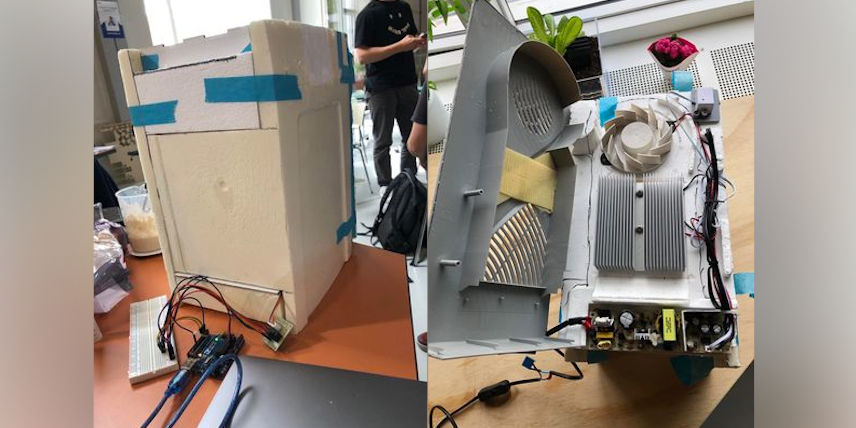

Tweaking all the systems to be more optimized after running lots of tests...

Now we had all the different mechanisms working and were about to optimize different components, because we had time to do it. The mill that was dispensing the flour was for instance not running smoothly, so we filed it and glued the servo motor firmly. We also looked at the measurements and openings for the outer box, so it can appear more aesthetic.
### Cooling
We have decided that we do not have the time to keep experimenting with the cooling. Therefore we have decided to buy a cooling box and use their sistem.

After 30 minutes the temperature inside the box dropped from 24°C to 5°C meaning we achieved the temperature of a refrigerator inside the box.