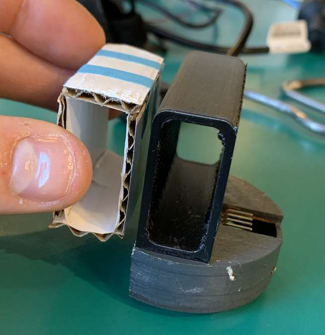
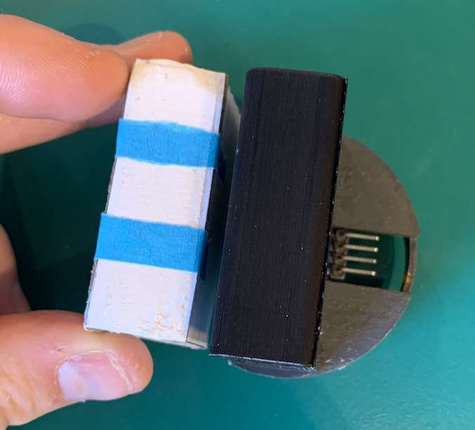

Is it possible to power all subsystems with a single PSU? Read to find out.

Today, we were experimenting with the electric circuit and to determine the options of how to give all our subsystem power from the same power supply. We also tried to optimize the look and tried to laser cut the outer shell in cardboard to see if the measurements fitted nicely. From there we wanted some kind of ornament with our name and perhaps a logo. The last thing we needed to make interiorly was to insert a housing for the ultrasound sensor, and integrate that into our design.

