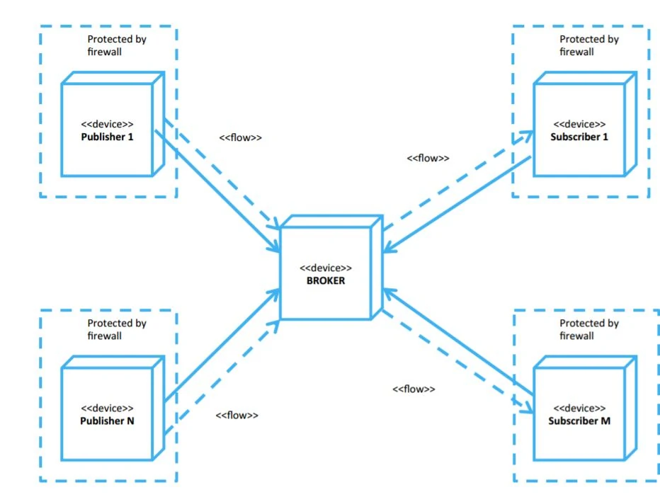

We spent the day configuring **Node-RED**, **MQTT**, and deployment to MS Azure.

## Setup & Configuration
First thing we did was to spin up a VM on Azure, on which we installed NodeJS, along with node-RED as a global `npm` package. We wanted to create a MQTT broker that our smart devices can talk to, so we used [maqiatto](https://maqiatto.com/)
as a service and hooked it up in node-RED using the MQTT-out node.

In that way, node-RED is acting as a MQTT client hosted on Azure, and then we can add as many devices / topics with MQTT clients as needed - e.g. `ESP32` chips such as the Node MCU.

This diagram shows our setup in a generalised fashion. We use Node-RED to create flows, which control how we interact with the MQTT devices and topics. We will be needing 2 topics, one for each Node MCU / `ESP32` module. Everything goes back and forth between the MQTT broker, which is run by a 3rd party service, [maqiatto](https://maqiatto.com/).

## Homework
We decided some group members should prepare some work before next friday.

**Andreas & Kristoffer:**
* Rain mechanism
* Driving a motor
* Brainstorming on casing (indoor module)

**Alex & Jonathan:**
* Rain sensor
* Write blog
* Brainstorming casing (outdoor module)

By planning ahead, we are able to spend time in the entire group more efficiently when we meet at fridays, as we can then focus on getting Node-RED and the IoT part of the project working.